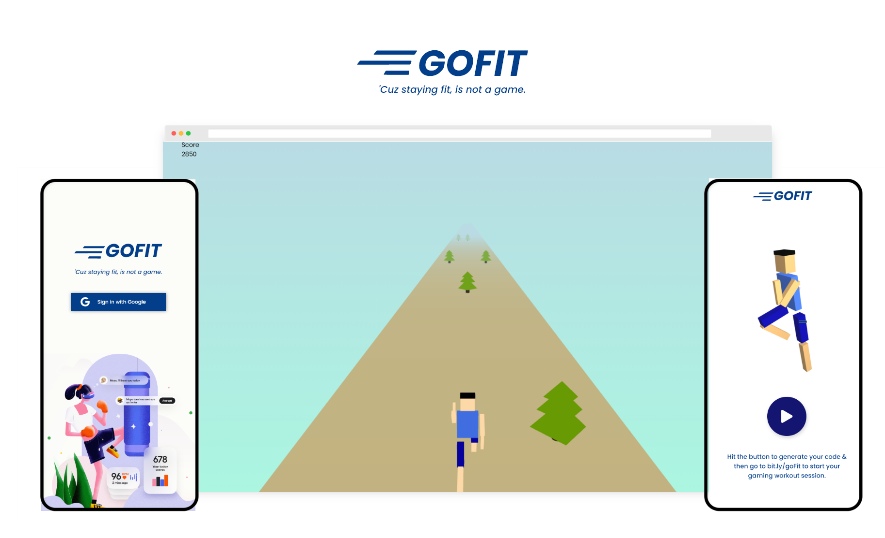

  <h1 align="center"> GoFit </h1>

<i>Cuz' staying fit is not a game : )</i>
.

Currently, we all have experienced covid and saw how it's hard for people to exercise or work out. Staying physically healthy is the most important thing.

### That's why we made, GoFit!

GoFit is subway surfers like game where you control the player by actually jumping, moving left and right in your real world.

Trust us, It's super fun to spend time on the game while also getting your workout done. Entertainment and health together!

### How it works?

GoFit is a game where you strap your phone on your arm. Stand in front of your laptop with the GoFit website open. A game starts playing on the laptop where your character is running and obstacles are coming from the front(similar to Subway Surfers). You have to actually jump, turn left and right to control your character.

#### The phone straped to your arm records your movements and send it to the game in real-time.

#### Tech stack ?

1. Flutter for cross-platform app
2. Firebase Auth for authentication
3. Cloud Firestore database
4. Three.js and HTML/CSS for website

